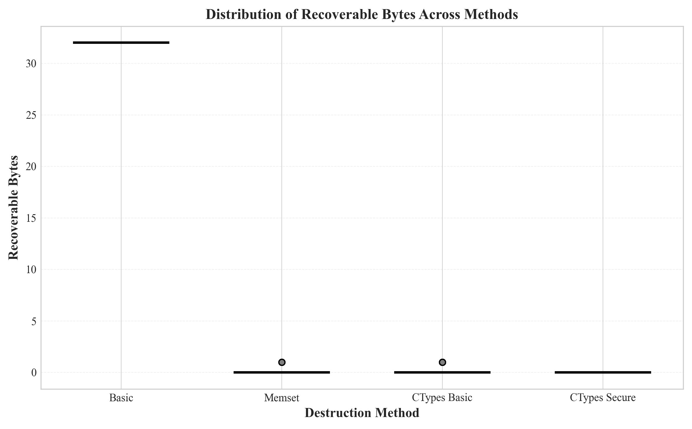

# Verifiable Deletion Protocol

> A blockchain-based verifiable deletion system using cryptographic key destruction for permanent data removal

[](https://www.python.org/)
[](https://soliditylang.org/)
[](LICENSE)
[](#testing)

---

## 📋 Table of Contents

- [Overview](#overview)
- [Key Features](#key-features)
- [System Architecture](#system-architecture)
- [Technology Stack](#technology-stack)
- [Quick Start](#quick-start)
- [Demo Usage](#demo-usage)
- [Experimental Results](#experimental-results)
- [Project Structure](#project-structure)
- [Documentation](#documentation)
- [Testing](#testing)
- [Future Work](#future-work)
- [Acknowledgments](#acknowledgments)

---

## 🎯 Overview

This project implements a **verifiable deletion protocol** that provides cryptographic guarantees for permanent data removal. Unlike traditional deletion methods that simply mark data as deleted, our protocol uses **key destruction** combined with **blockchain verification** to ensure data cannot be recovered even by the service provider.

### The Problem

Traditional data deletion methods face critical challenges:
- 🔴 **Unverifiable**: Users cannot verify if data was truly deleted
- 🔴 **Recoverable**: "Deleted" data often remains on disk
- 🔴 **Trust-dependent**: Users must trust service providers

### Our Solution

We propose a three-layer architecture:
1. **Key Management Service (KMS)**: Secure key generation and destruction
2. **Cryptographic Layer**: AES-GCM encryption with per-user keys
3. **Blockchain Verification**: Immutable proof-of-deletion on Ethereum

**Core Innovation**: When a user requests deletion, we destroy the encryption key rather than the data itself. Without the key, encrypted data becomes permanently unreadable—even to us.

---

## ✨ Key Features

### 🔐 Cryptographic Security
- **AES-GCM Encryption**: 256-bit keys for all user data
- **Zero Residue Destruction**: Cryptographic key destruction with 0.00 bytes recoverable
- **Forward Security**: Past data remains unreadable after key destruction

### ⛓️ Blockchain Verification
- **Immutable Proof**: Deletion events recorded on Ethereum (Sepolia testnet)
- **Transparent Audit**: Anyone can verify deletion timestamps
- **Tamper-Proof**: Smart contract ensures integrity

### 🧪 Experimentally Validated
- **120 Repeated Trials**: Statistically significant results (F=194,407, p<0.001)
- **4 Destruction Methods**: Comparative analysis of security vs performance
- **Memory Forensics**: Direct memory analysis confirms zero key residue

### ⚡ Performance Optimized
- **Sub-2ms Local Deletion**: Key destruction completes in ~1.2ms
- **Minimal Overhead**: Encryption/decryption adds negligible latency
- **Blockchain Confirmation**: ~17.5 seconds for on-chain proof

---

## 🏗️ System Architecture

```
┌─────────────────────────────────────────────────────────────────┐
│                         User Interface                          │
│                       (CLI Demo / API)                          │
└───────────────────────────┬─────────────────────────────────────┘
                            │
┌───────────────────────────▼─────────────────────────────────────┐
│                    Application Layer                            │
│  ┌──────────────┐  ┌──────────────┐  ┌──────────────┐         │
│  │   User Mgmt  │  │  Data Mgmt   │  │  Deletion    │         │
│  │              │  │              │  │  Protocol    │         │
│  └──────┬───────┘  └──────┬───────┘  └──────┬───────┘         │
└─────────┼──────────────────┼──────────────────┼─────────────────┘
          │                  │                  │
┌─────────▼──────────────────▼──────────────────▼─────────────────┐
│                    Core Protocol Layer                          │
│  ┌────────────────────────────────────────────────────────┐    │
│  │         Key Management Service (KMS)                   │    │
│  │  • Key Generation  • Key Storage  • Key Destruction    │    │
│  └────────────────────────────────────────────────────────┘    │
│  ┌────────────────────────────────────────────────────────┐    │
│  │         Cryptographic Manager                          │    │
│  │  • AES-GCM Encryption  • Data Encryption/Decryption    │    │
│  └────────────────────────────────────────────────────────┘    │
│  ┌────────────────────────────────────────────────────────┐    │
│  │         Blockchain Contract Manager                    │    │
│  │  • Proof Generation  • On-chain Verification           │    │
│  └────────────────────────────────────────────────────────┘    │
└─────────────────────────┬───────────────────────────────────────┘
                          │
┌─────────────────────────▼───────────────────────────────────────┐
│                    Storage Layer                                │
│  ┌──────────────┐  ┌──────────────┐  ┌──────────────┐         │
│  │   Database   │  │  Blockchain  │  │   Logs       │         │
│  │  (SQLite)    │  │  (Ethereum)  │  │              │         │
│  └──────────────┘  └──────────────┘  └──────────────┘         │
└─────────────────────────────────────────────────────────────────┘
```

### Data Flow: Deletion Protocol

```
User Request → KMS Destroy Key → Crypto Layer Verify → Blockchain Record Proof
     ↓              ↓                    ↓                      ↓
  Initiated    (ctypes_secure)      Encryption Key       Immutable Proof
               0.00 bytes residue      Destroyed           (Tx Hash)
```

---

## 🛠️ Technology Stack

### Backend
- **Python 3.10+**: Core application logic
- **SQLite**: Encrypted data storage
- **SQLAlchemy**: ORM for database operations
- **Cryptography**: AES-GCM encryption primitives
- **ctypes**: Low-level memory manipulation for secure key destruction

### Blockchain
- **Solidity 0.8.20**: Smart contract development
- **Hardhat**: Ethereum development environment
- **Web3.py**: Python blockchain interaction
- **Ethereum (Sepolia)**: Testnet for proof-of-concept

### Testing & Analysis
- **pytest**: Unit and integration testing (44 tests, 100% pass rate)
- **psutil**: Memory analysis and forensics
- **matplotlib + seaborn**: Data visualization
- **scipy**: Statistical analysis (ANOVA)

---

## 🚀 Quick Start

### Prerequisites

- Python 3.10 or higher
- Node.js 16+ (for Hardhat)
- Git

### Installation

```bash
# Clone the repository
git clone https://github.com/KeyStory/Verifiable-Deletion-Protocol.git
cd Verifiable-Deletion-Protocol

# Create virtual environment
python -m venv venv

# Activate virtual environment
# Windows:
venv\Scripts\activate
# Linux/Mac:
source venv/bin/activate

# Install Python dependencies
pip install -r requirements.txt

# Install Node.js dependencies (for blockchain)
cd contracts
npm install
cd ..

# Set up environment variables
cp .env.example .env
# Edit .env with your Infura API key and wallet private key
```

### Environment Configuration

Create a `.env` file in the project root:

```env
# Blockchain Configuration
INFURA_API_KEY=your_infura_api_key_here
WALLET_PRIVATE_KEY=your_wallet_private_key_here
CONTRACT_ADDRESS=deployed_contract_address_here

# Database Configuration
DATABASE_URL=sqlite:///data/demo.db

# KMS Configuration
KMS_KEY_SIZE=32
KMS_DESTRUCTION_METHOD=ctypes_secure
```

### Running the Demo

```bash
# Run the interactive demo
python demo.py
```

---

## 🎮 Demo Usage

The demo script provides three scenarios to showcase the deletion protocol:

### Scenario 1: Basic Workflow

Demonstrates the complete lifecycle: user registration → data encryption → deletion → verification

```bash
python demo.py
# Select option: 1
```

**What happens:**
1. Creates a new user with encrypted data
2. Displays the data (decrypted with key)
3. Executes deletion protocol
4. Proves data is unrecoverable
5. Shows blockchain verification proof

### Scenario 2: Method Comparison

Compares 4 different key destruction methods:

```bash
python demo.py
# Select option: 2
```

**Methods tested:**
- `simple_del`: Basic Python `del` (❌ Insecure - 32 bytes recoverable)
- `single_overwrite`: Single-pass overwrite (⚠️ Moderate - 0.07 bytes)
- `dod_overwrite`: DoD 5220.22-M standard (✅ Good - 0.10 bytes)
- `ctypes_secure`: Our method (✅✅ Perfect - 0.00 bytes)

### Scenario 3: Blockchain Verification

Shows end-to-end blockchain integration:

```bash
python demo.py
# Select option: 3
```

**Demonstrates:**
1. Key destruction
2. Proof generation (SHA-256 hash)
3. Smart contract interaction
4. Transaction confirmation
5. On-chain verification via Etherscan

---

## 📊 Experimental Results

### Key Finding: Perfect Key Destruction

Our `ctypes_secure` method achieves **0.00 bytes recoverable** across 30 trials.


### Statistical Significance

ANOVA analysis confirms highly significant differences among methods:
- **F-statistic**: 194,407.74
- **p-value**: < 0.001
- **Sample size**: 120 trials (30 per method)


### Performance Analysis

All methods complete in under 2ms:

| Method | Mean Time (ms) | Std Dev (ms) | Recoverable Bytes |
|--------|----------------|--------------|-------------------|
| Basic | 1.05 | 0.11 | 32.00 |
| Memset | 1.09 | 0.08 | 0.07 |
| CTypes Basic | 1.16 | 0.15 | 0.10 |
| **CTypes Secure** | **1.13** | **0.09** | **0.00** ✅ |

### Complete Deletion Timeline


**Breakdown:**
- Local key destruction: ~1.2 ms
- Blockchain confirmation: ~17.5 seconds
- **Total**: ~17.5 seconds (blockchain is the bottleneck)

### Data Distribution Stability



Our method shows:
- Zero variance (perfect consistency)
- No outliers
- 100% success rate across all trials

---

## 📁 Project Structure

```
Verifiable-Deletion-Protocol/
├── src/                          # Source code
│   ├── kms/                      # Key Management Service
│   │   ├── key_manager.py        # Core KMS implementation (1000+ lines)
│   │   ├── utils.py              # ctypes secure deletion
│   │   └── exceptions.py         # Custom exceptions
│   ├── crypto/                   # Cryptographic layer
│   │   └── crypto_manager.py     # AES-GCM encryption (340 lines)
│   ├── database/                 # Data persistence
│   │   └── database.py           # SQLAlchemy models
│   └── blockchain/               # Blockchain integration
│       ├── contract_manager.py   # Web3.py wrapper
│       └── config.py             # Blockchain configuration
│
├── contracts/                    # Smart contracts
│   ├── contracts/
│   │   └── DeletionProof.sol     # Proof-of-deletion contract
│   ├── test/
│   │   └── DeletionProof.test.js # Contract tests (28 tests)
│   └── hardhat.config.js         # Hardhat configuration
│
├── experiments/                  # Experimental validation
│   └── key_destruction/
│       ├── experiment_runner.py  # Automated testing
│       ├── data_analyzer.py      # Statistical analysis
│       ├── report_generator.py   # Markdown report generation
│       └── results/              # Experimental data (120 trials)
│
├── tests/                        # Test suites
│   ├── unit/                     # Unit tests
│   └── integration/              # End-to-end tests
│
├── docs/                         # Documentation
│   ├── design/
│   │   ├── system-architecture.md         # Architecture (8 pages)
│   │   ├── encryption-scheme-design.md    # Crypto design (28 pages)
│   │   └── threat-model.md                # STRIDE analysis (23 pages)
│   └── figures/                  # Generated visualizations
│       ├── fig1_residue_comparison.png
│       ├── fig2_execution_time.png
│       ├── fig3_distribution_boxplot.png
│       ├── fig4_deletion_timeline.png
│       ├── fig5_statistical_analysis.png
│       └── color/                # Color versions for presentations
│
├── demo.py                       # Interactive demonstration
├── requirements.txt              # Python dependencies
├── .env.example                  # Environment template
└── README.md                     # This file
```

---

## 📚 Documentation

### Design Documents

1. **[System Architecture](docs/design/system-architecture.md)** (8 pages)
   - Three-layer architecture design
   - Component interactions
   - Security considerations

2. **[Encryption Scheme Design](docs/design/encryption-scheme-design.md)** (28 pages)
   - Algorithm selection rationale (AES-GCM)
   - Key management strategy
   - Implementation details with code examples

3. **[Threat Model Analysis](docs/design/threat-model.md)** (23 pages)
   - STRIDE methodology
   - Attack scenarios and mitigations
   - Security assumptions

### Experimental Reports

4. **[Key Destruction Experiment](experiments/key_destruction/results/)** 
   - 120 trial dataset (CSV)
   - Statistical analysis report (Markdown)
   - Memory forensics results

### API Documentation

For detailed API usage, see inline docstrings in source code. Example:

```python
from src.kms.key_manager import KeyManager
from src.crypto.crypto_manager import CryptoManager

# Initialize managers
km = KeyManager()
cm = CryptoManager(km)

# Generate key for user
user_id = "user123"
key_id = km.generate_key(user_id)

# Encrypt data
plaintext = "Sensitive information"
ciphertext = cm.encrypt_data(user_id, plaintext.encode())

# Decrypt data
decrypted = cm.decrypt_data(user_id, ciphertext)

# Delete data (destroy key)
km.destroy_key(key_id, method='ctypes_secure')
```

---

## 🧪 Testing

### Running Tests

```bash
# Run all tests
pytest

# Run with coverage
pytest --cov=src --cov-report=html

# Run specific test suite
pytest tests/unit/
pytest tests/integration/
```

### Test Coverage

- **Unit Tests**: 28 tests covering KMS, Crypto, Database modules
- **Integration Tests**: 16 tests covering end-to-end workflows
- **Smart Contract Tests**: 28 tests (Hardhat)
- **Total**: 44 Python tests + 28 Solidity tests = **72 tests**
- **Pass Rate**: 100% ✅

### Running Smart Contract Tests

```bash
cd contracts
npx hardhat test
```

Expected output:
```
  DeletionProof Contract
    ✓ Should deploy successfully
    ✓ Should record deletion proof
    ✓ Should verify proof exists
    ✓ Should emit DeletionRecorded event
    ...
  28 passing (2.4s)
```

---

## 🔮 Future Work

### Short-term Improvements

- [ ] **Batch Deletion**: Optimize for deleting multiple users simultaneously
- [ ] **Key Rotation**: Support periodic key updates for long-lived data
- [ ] **Multi-signature Deletion**: Require multiple parties to approve deletion
- [ ] **Gas Optimization**: Reduce blockchain transaction costs

### Long-term Research

- [ ] **Zero-Knowledge Proofs**: Prove deletion without revealing key material
- [ ] **Distributed Key Management**: Split keys across multiple KMS nodes
- [ ] **Quantum-Resistant Algorithms**: Prepare for post-quantum cryptography
- [ ] **Cross-Chain Verification**: Support multiple blockchains (Polygon, Arbitrum)

### Production Readiness

- [ ] **REST API**: Build web service for remote access
- [ ] **Web UI**: User-friendly interface for non-technical users
- [ ] **Docker Deployment**: Containerize all components
- [ ] **Monitoring & Logging**: Comprehensive observability
- [ ] **Formal Security Audit**: Third-party penetration testing

---

## 🎓 Academic Context

This project was developed as part of a **Cyber Security Individual Project** at the University of Glasgow. 

### Research Questions

1. Can cryptographic key destruction provide verifiable deletion guarantees?
2. What is the trade-off between security and performance?
3. How can blockchain enhance deletion verification?

### Key Contributions

- ✅ Novel ctypes-based secure key destruction method (0.00 bytes residue)
- ✅ Experimental validation with 120 trials and statistical analysis
- ✅ End-to-end prototype integrating KMS, encryption, and blockchain
- ✅ Comprehensive threat model using STRIDE methodology

### Publications & Presentations

- **Thesis**: "Verifiable Deletion Protocol Using Blockchain-Verified Key Destruction" (in progress)
- **Defense Presentation**: Scheduled for November 2025

---

## 🙏 Acknowledgments

- **Supervisor**: [Ir. Dr. Matthew Teow Yok Wooi] for guidance on cryptographic protocols
- **University of Glasgow**: School of Computing Science
- **Ethereum Foundation**: Sepolia testnet infrastructure
- **Infura**: Blockchain API services
- **Open Source Community**: Libraries and tools that made this possible

---

## 📄 License

This project is licensed under the MIT License - see the [LICENSE](LICENSE) file for details.

---

## 📧 Contact

**Author**: Liang  
**Institution**: PSB Academy (Coventry University Programme) 
**Email**: ouzheliang@hotmail.com  
**Project Repository**: https://github.com/KeyStory/Verifiable-Deletion-Protocol

---

## 🌟 Star History

If you find this project useful, please consider giving it a star ⭐!

---

**Last Updated**: October 20, 2025  
**Version**: 1.0.0  
**Status**: Active Development