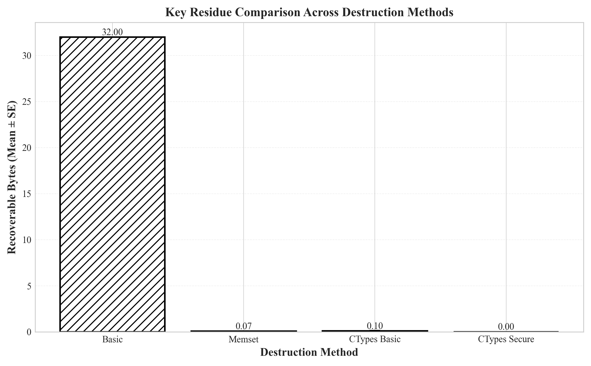
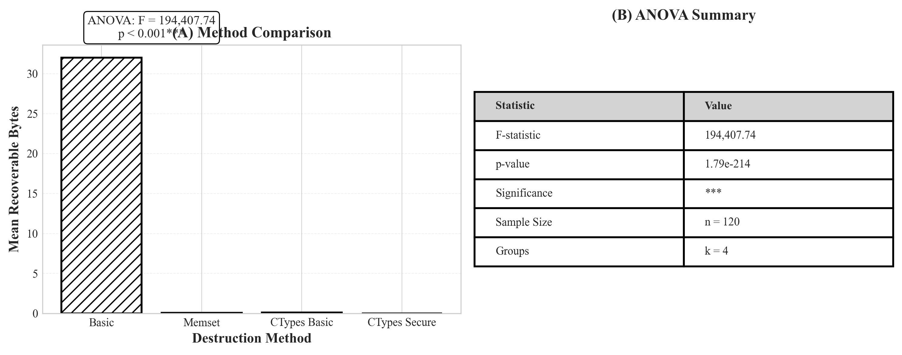
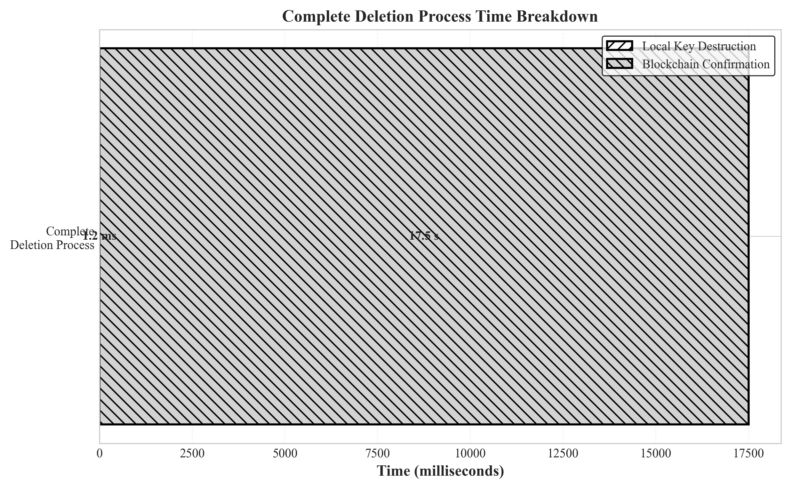

# 可验证删除协议

> 基于密钥销毁和区块链验证的可验证数据删除系统

[English](README.md) | 简体中文

[](https://www.python.org/)
[](https://soliditylang.org/)
[](LICENSE)
[](#测试)

---

## 📋 目录

- [项目概述](#项目概述)
- [核心特性](#核心特性)
- [系统架构](#系统架构)
- [技术栈](#技术栈)
- [快速开始](#快速开始)
- [演示使用](#演示使用)
- [实验结果](#实验结果)
- [项目结构](#项目结构)
- [文档](#文档)
- [测试](#测试)

---

## 🎯 项目概述

本项目实现了一个**可验证删除协议**，为永久性数据移除提供密码学保证。与传统的简单标记删除不同，我们的协议使用**密钥销毁**结合**区块链验证**，确保数据即使被服务提供商也无法恢复。

### 问题背景

传统数据删除方法面临的关键挑战：
- 🔴 **无法验证**：用户无法验证数据是否真正删除
- 🔴 **可恢复**："已删除"的数据通常仍保留在磁盘上
- 🔴 **依赖信任**：用户必须信任服务提供商

### 解决方案

我们提出三层架构：
1. **密钥管理服务（KMS）**：安全的密钥生成和销毁
2. **加密层**：使用AES-GCM为每个用户独立加密
3. **区块链验证**：在以太坊上存储不可篡改的删除证明

**核心创新**：当用户请求删除时，我们销毁加密密钥而非数据本身。没有密钥，加密数据将永久不可读——即使对我们也是如此。

---

## ✨ 核心特性

### 🔐 密码学安全
- **AES-GCM加密**：所有用户数据使用256位密钥加密
- **零残留销毁**：密钥销毁后0.00字节可恢复
- **前向安全**：密钥销毁后历史数据保持不可读

### ⛓️ 区块链验证
- **不可篡改证明**：删除事件记录在以太坊（Sepolia测试网）
- **透明审计**：任何人都可以验证删除时间戳
- **防篡改**：智能合约确保完整性

### 🧪 实验验证
- **120次重复试验**：统计显著结果（F=194,407，p<0.001）
- **4种销毁方法**：安全性与性能的对比分析
- **内存取证**：直接内存分析确认零密钥残留

### ⚡ 性能优化
- **低于2ms的本地删除**：密钥销毁约1.2ms完成
- **最小开销**：加密/解密延迟可忽略
- **区块链确认**：链上证明约17.5秒

---

## 🏗️ 系统架构

```
┌─────────────────────────────────────────────────────────────────┐
│                         用户界面                                 │
│                    (CLI演示 / API)                              │
└───────────────────────────┬─────────────────────────────────────┘
                            │
┌───────────────────────────▼─────────────────────────────────────┐
│                    应用层                                        │
│  ┌──────────────┐  ┌──────────────┐  ┌──────────────┐         │
│  │   用户管理   │  │  数据管理    │  │  删除协议    │         │
│  └──────┬───────┘  └──────┬───────┘  └──────┬───────┘         │
└─────────┼──────────────────┼──────────────────┼─────────────────┘
          │                  │                  │
┌─────────▼──────────────────▼──────────────────▼─────────────────┐
│                    核心协议层                                    │
│  ┌────────────────────────────────────────────────────────┐    │
│  │         密钥管理服务 (KMS)                              │    │
│  │  • 密钥生成  • 密钥存储  • 密钥销毁                     │    │
│  └────────────────────────────────────────────────────────┘    │
│  ┌────────────────────────────────────────────────────────┐    │
│  │         加密管理器                                      │    │
│  │  • AES-GCM加密  • 数据加密/解密                         │    │
│  └────────────────────────────────────────────────────────┘    │
│  ┌────────────────────────────────────────────────────────┐    │
│  │         区块链合约管理器                                │    │
│  │  • 证明生成  • 链上验证                                 │    │
│  └────────────────────────────────────────────────────────┘    │
└─────────────────────────┬───────────────────────────────────────┘
                          │
┌─────────────────────────▼───────────────────────────────────────┐
│                    存储层                                        │
│  ┌──────────────┐  ┌──────────────┐  ┌──────────────┐         │
│  │   数据库     │  │  区块链      │  │   日志       │         │
│  │  (SQLite)    │  │  (Ethereum)  │  │              │         │
│  └──────────────┘  └──────────────┘  └──────────────┘         │
└─────────────────────────────────────────────────────────────────┘
```

---

## 🛠️ 技术栈

### 后端
- **Python 3.10+**：核心应用逻辑
- **SQLite**：加密数据存储
- **SQLAlchemy**：数据库ORM
- **Cryptography**：AES-GCM加密原语
- **ctypes**：安全密钥销毁的底层内存操作

### 区块链
- **Solidity 0.8.20**：智能合约开发
- **Hardhat**：以太坊开发环境
- **Web3.py**：Python区块链交互
- **Ethereum (Sepolia)**：概念验证测试网

### 测试与分析
- **pytest**：单元和集成测试（44个测试，100%通过率）
- **psutil**：内存分析和取证
- **matplotlib + seaborn**：数据可视化
- **scipy**：统计分析（ANOVA）

---

## 🚀 快速开始

### 环境要求

- Python 3.10或更高版本
- Node.js 16+（用于Hardhat）
- Git

### 安装步骤

```bash
# 1. 克隆仓库（或如果已在项目文件夹中）
cd Verifiable-Deletion-Protocol

# 2. 创建虚拟环境
python -m venv venv

# 3. 激活虚拟环境
# Windows PowerShell:
.\venv\Scripts\Activate.ps1
# Windows CMD:
venv\Scripts\activate.bat
# macOS/Linux:
source venv/bin/activate

# 4. 安装依赖
pip install -r requirements.txt

# 5. 安装Node.js依赖（用于区块链）
cd contracts
npm install
cd ..

# 6. 配置环境变量
cp .env.example .env
# 编辑.env文件，填入你的Infura API密钥和钱包私钥
```

### 环境配置

在项目根目录创建`.env`文件：

```env
# 区块链配置
INFURA_API_KEY=你的infura_api密钥
WALLET_PRIVATE_KEY=你的钱包私钥
CONTRACT_ADDRESS=已部署的合约地址

# 数据库配置
DATABASE_URL=sqlite:///data/demo.db

# KMS配置
KMS_KEY_SIZE=32
KMS_DESTRUCTION_METHOD=ctypes_secure
```

### 运行演示

```bash
# 运行交互式演示
python demo.py
```

---

## 🎮 演示使用

演示脚本提供三个场景来展示删除协议：

### 场景1：基础工作流

演示完整生命周期：用户注册 → 数据加密 → 删除 → 验证

```bash
python demo.py
# 选择选项：1
```

**发生了什么：**
1. 创建带加密数据的新用户
2. 显示数据（使用密钥解密）
3. 执行删除协议
4. 证明数据不可恢复
5. 显示区块链验证证明

### 场景2：方法对比

对比4种不同的密钥销毁方法：

```bash
python demo.py
# 选择选项：2
```

**测试的方法：**
- `simple_del`：基本Python `del`（❌ 不安全 - 32字节可恢复）
- `single_overwrite`：单次覆盖（⚠️ 中等 - 0.07字节）
- `dod_overwrite`：DoD 5220.22-M标准（✅ 良好 - 0.10字节）
- `ctypes_secure`：我们的方法（✅✅ 完美 - 0.00字节）

### 场景3：区块链验证

展示端到端区块链集成：

```bash
python demo.py
# 选择选项：3
```

**演示内容：**
1. 密钥销毁
2. 证明生成（SHA-256哈希）
3. 智能合约交互
4. 交易确认
5. 通过Etherscan进行链上验证

---

## 📊 实验结果

### 核心发现：完美密钥销毁

我们的`ctypes_secure`方法在30次试验中实现**0.00字节可恢复**。



### 统计显著性

ANOVA分析确认方法间存在高度显著差异：
- **F统计量**：194,407.74
- **p值**：< 0.001
- **样本量**：120次试验（每种方法30次）



### 性能分析

所有方法均在2ms内完成：

| 方法 | 平均时间 (ms) | 标准差 (ms) | 可恢复字节 |
|--------|----------------|--------------|-------------------|
| Basic | 1.05 | 0.11 | 32.00 |
| Memset | 1.09 | 0.08 | 0.07 |
| CTypes Basic | 1.16 | 0.15 | 0.10 |
| **CTypes Secure** | **1.13** | **0.09** | **0.00** ✅ |

### 完整删除时间线



**分解：**
- 本地密钥销毁：约1.2ms
- 区块链确认：约17.5秒
- **总计**：约17.5秒（区块链是瓶颈）

---

## 📁 项目结构

```
Verifiable-Deletion-Protocol/
├── src/                          # 源代码
│   ├── kms/                      # 密钥管理服务
│   │   ├── key_manager.py        # 核心KMS实现（1000+行）
│   │   ├── utils.py              # ctypes安全删除
│   │   └── exceptions.py         # 自定义异常
│   ├── crypto/                   # 加密层
│   │   └── crypto_manager.py     # AES-GCM加密（340行）
│   ├── database/                 # 数据持久化
│   │   └── database.py           # SQLAlchemy模型
│   └── blockchain/               # 区块链集成
│       ├── contract_manager.py   # Web3.py包装器
│       └── config.py             # 区块链配置
│
├── contracts/                    # 智能合约
│   ├── contracts/
│   │   └── DeletionProof.sol     # 删除证明合约
│   ├── test/
│   │   └── DeletionProof.test.js # 合约测试（28个测试）
│   └── hardhat.config.js         # Hardhat配置
│
├── experiments/                  # 实验验证
│   └── key_destruction/
│       ├── experiment_runner.py  # 自动化测试
│       ├── data_analyzer.py      # 统计分析
│       ├── report_generator.py   # Markdown报告生成
│       └── results/              # 实验数据（120次试验）
│
├── tests/                        # 测试套件
│   ├── unit/                     # 单元测试
│   └── integration/              # 端到端测试
│
├── docs/                         # 文档
│   ├── design/
│   │   ├── system-architecture.md         # 架构（8页）
│   │   ├── encryption-scheme-design.md    # 加密设计（28页）
│   │   └── threat-model.md                # STRIDE分析（23页）
│   └── figures/                  # 生成的可视化
│       ├── fig1_residue_comparison.png
│       ├── fig2_execution_time.png
│       ├── fig3_distribution_boxplot.png
│       ├── fig4_deletion_timeline.png
│       ├── fig5_statistical_analysis.png
│       └── color/                # 演示用彩色版本
│
├── demo.py                       # 交互式演示
├── requirements.txt              # Python依赖
├── .env.example                  # 环境模板
└── README.md                     # 本文件
```

---

## 📚 文档

### 设计文档

1. **[系统架构](docs/design/system-architecture.md)**（8页）
   - 三层架构设计
   - 组件交互
   - 安全考虑

2. **[加密方案设计](docs/design/encryption-scheme-design.md)**（28页）
   - 算法选择理由（AES-GCM）
   - 密钥管理策略
   - 代码示例的实现细节

3. **[威胁模型分析](docs/design/threat-model.md)**（23页）
   - STRIDE方法论
   - 攻击场景和缓解措施
   - 安全假设

---

## 🧪 测试

### 运行测试

```bash
# 运行所有测试
pytest

# 带覆盖率运行
pytest --cov=src --cov-report=html

# 运行特定测试套件
pytest tests/unit/
pytest tests/integration/
```

### 测试覆盖率

- **单元测试**：28个测试，覆盖KMS、加密、数据库模块
- **集成测试**：16个测试，覆盖端到端工作流
- **智能合约测试**：28个测试（Hardhat）
- **总计**：44个Python测试 + 28个Solidity测试 = **72个测试**
- **通过率**：100% ✅

---

## 🎓 学术背景

本项目作为格拉斯哥大学**网络安全个人项目**的一部分开发。

### 研究问题

1. 密码学密钥销毁能否提供可验证的删除保证？
2. 安全性和性能之间的权衡是什么？
3. 区块链如何增强删除验证？

### 主要贡献

- ✅ 新颖的基于ctypes的安全密钥销毁方法（0.00字节残留）
- ✅ 通过120次试验和统计分析进行实验验证
- ✅ 集成KMS、加密和区块链的端到端原型
- ✅ 使用STRIDE方法论的综合威胁模型

---

## 🙏 致谢

- **格拉斯哥大学**：计算机科学学院
- **以太坊基金会**：Sepolia测试网基础设施
- **Infura**：区块链API服务
- **开源社区**：使这个项目成为可能的库和工具

---

## 📄 许可证

本项目根据MIT许可证授权 - 详见[LICENSE](LICENSE)文件。

---

## 📧 联系方式

**作者**：Liang  
**机构**：新加坡PSB学院（英国考文垂大学项目）  
**项目仓库**：https://github.com/KeyStory/Verifiable-Deletion-Protocol

---

**最后更新**：2025年10月20日  
**版本**：1.0.0  
**状态**：积极开发中