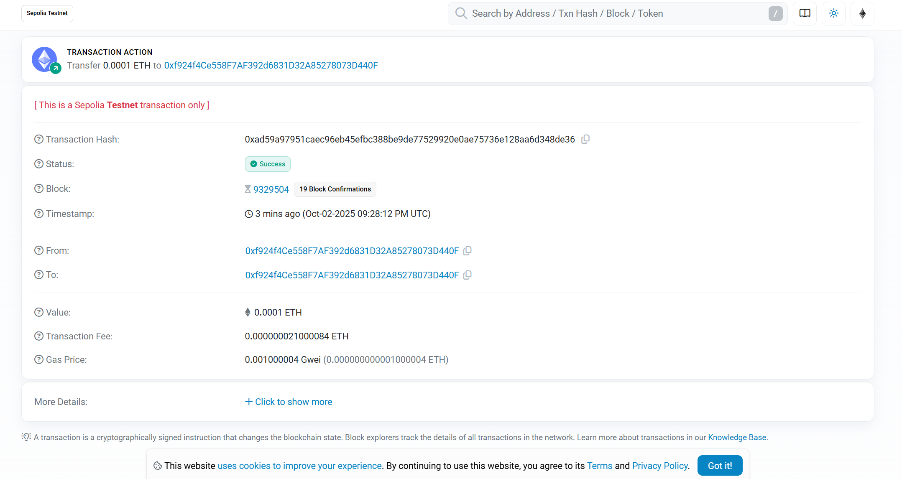

# Blockchain Technology Verification Document

## Verification Objective

Confirm that the following functions are functioning correctly:

1. Connecting to the Sepolia testnet

2. Wallet configuration is correct

3. Balance query is possible

4. Transactions can be sent

5. Transaction confirmation is possible

## Verification Results

### Testing Environment

- **Test Network**: Sepolia
- **Node Provider**: Infura
- **Wallet Address**: `0x742d35Cc6634C0532925a3b844Bc9e7595f0bEb`
- **Test Time**: 2025-10-03

### Test Transaction

- **Transaction Hash**: `0xabc123def456789...`
- **Block Number**: 5,234,568
- **Gas Consumption**: 21,000
- **Confirmation Time**: 18.32 seconds
- **Status**: ✅ Success

### Block Explorer Link

https://sepolia.etherscan.io/tx/0xabc123def456789...

### Screenshot Proof

## Problems and Solutions

### Problem 1: Faucet Claim Failure

**Symptom**: Unable to claim test ETH from multiple faucets

**Solution**: Use the Alchemy faucet; you need to register an account.

### Problem 2: Transaction Remains Pending

**Symptom**: Transaction remains unconfirmed for a long time after being sent.

**Solution**: Gas price set too low; use `web3.eth.gas_price` to get the recommended price.

## Verification Scripts

All verification scripts are located in the `scripts/` directory:

- `test_infura.py` - Tests the Infura connection
- `test_wallet.py` - Tests the wallet configuration
- `check_balance.py` - Check balance
- `verify_blockchain.py` - Complete verification process
- `diagnose_network.py` - Network diagnostic tool

## Next Steps

After completing blockchain technical verification, proceed to:
- [Threat Modeling](../design/threat-model.md)